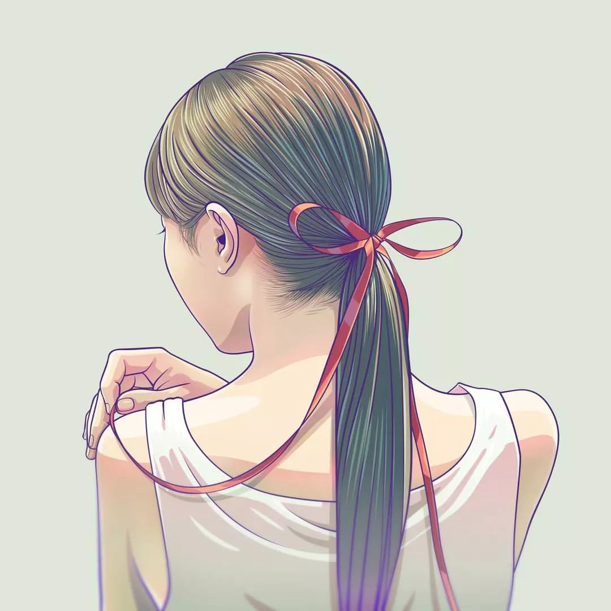

<iframe
      frameborder="no"
      **border="0"**
      marginwidth="0"
      marginheight="0"
      width="100%"
      height="86"
      src="//music.163.com/outchain/player?type=2&id=27548281&auto=0&height=66"
      loding="eager"
    ></iframe>

## 入选原则

- 漂亮

- 实际上就一点：漂亮，我认为的漂亮，像下面一样的漂亮

---

<strong>[花たん](https://music.163.com/#/artist?id=16523 "琉璃花-网易云音乐")</strong>：[歌に形はないけれど](https://music.163.com/#/song?id=27548281 "虽然歌声没有形状--花たん")

<strong>[Aimer](https://music.163.com/#/artist?id=16152 "Aimer-网易云音乐")</strong>：[蝶々結び](https://music.163.com/#/song?id=424474124 "蝴蝶结--Aimer")

> _~~我自认为对普通的三次元女孩子没有兴趣。~~_

> **但如果是像花たん一样音色多变，可甜可御的姐姐，**
> **又如Aimer一样音色独特，唱歌感情丰沛的姐姐，**
> **或是与IU一样绵绵奶音，可爱与性感并存的小姐姐**

> ***谁又会不喜欢呢？***
